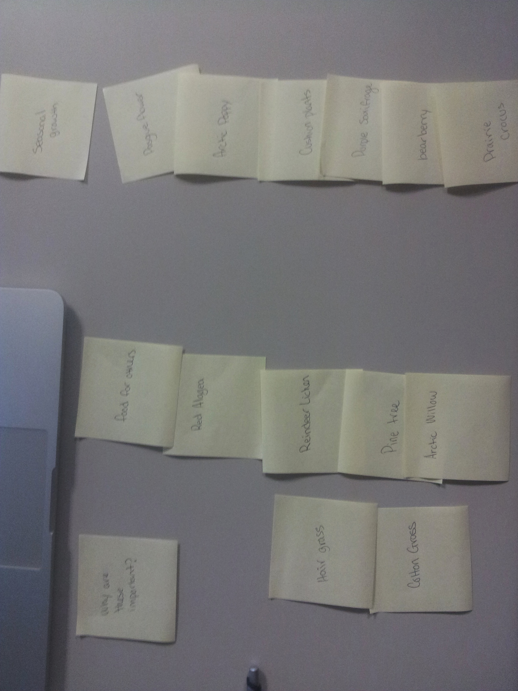

# Card sort report

The purpose of this card sort was to determine common navigation patterns and categories from the content of Arctic Plants.

## Specifics

The card sort was conducted by Cameron Webb on 14th of September between the times of 3:00 pm and 6:00 pm with the following participants:

- Ian
- Andy Ham

### Cards

14 cards were used covering a broad range of applicable content for the website. The following topics were used as cards:

1. why are they imporant
2. Hair Grass
3. Cotton Grass
4. Food For Others
5. Red Alagea
6. Reindeer Licken
7. Artic Willow
8. Seasonal Growth
9. Pasgue Flower
10. Arctic Poppy
11. Cushion Plants
12. Purple Saxifrage
13. Bearberry
14. Prairie Croctus

## Card sort results

*Card sort 1 by Ian*

*Card sort 2 by Any Ham*

## Observations

- Did the participants have any common comments?
	- They both had mentioned they had seemed fairly easy to catagorize. This could be because there are less catagories then there are actual plants and information on them.
- Did they have questions that stood out?
	- Not Really.
- Did they struggle with certain articles or topics?
	- No one had mentioned that they had.
- Did they find common groupings? Or were the groupings completely different?
	In both situations the groupings ended up being the exact same.
- Were some of the groupings completely unexpected?
	 Not so much, I wasn't really sure what to expect to be fair. Though I feel the were organized appropriately to what was there.
- Were the results similar to your expectations?
	As mentioned before I wasn't really sure what to expect.
- How did you feel while watching them perform the task?
	- I didn't really feel anthing curiousity if anything as to how they were going to be organized.