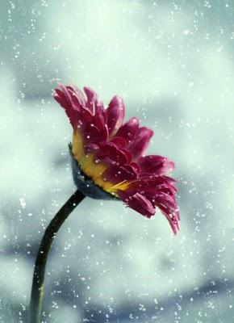

# Artic Plants

---
Why They are Important	- Food for Others - Seasonal Growth - Various Plants

---

This is a treasury on the information of all arctic plants with information on them that is known to date. Here you will be able to find information on everything from how the plants provide for the habitats that they grow in, the nutrients that they proivde, why they are important to the enviroment and ecology that they grow in as well as the seasonl growth and when and where to find the plants.

This site had been created for research and knowledge for any people involved in the studies of agriculture or if you are just looking to find new information. This site will provide you with the utmost amount of knowledge available on the subjects.

---
2013 Arctic Flowers - Terms 

___