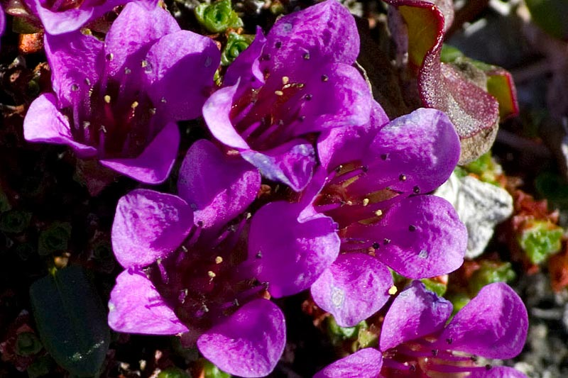

# Purple Saxifrage

---
Saxifraga oppositifolia, the purple saxifrage or purple mountain saxifrage

---

a species of edible plant that is very common all over the high Arctic and also some high mountainous areas further south, including northern Britain, the Alps and the Rocky Mountains. It is even known to grow on Kaffeklubben Island in north Greenland, at 83°40'N, the most northerly plant locality in the world.
It is a low-growing, densely or loosely matted plant growing to 3–5 cm high, with somewhat woody branches of creeping or trailing habit close to the surface. The leaves are small, rounded, scale-like, opposite in 4 rows, with ciliated margins. The flowers are solitary on short stalks, petals purple or lilac, much longer than the calyx lobes. It is one of the very first spring flowers, continuing to flower during the whole summer in localities where the snow melts later. The flowers grow to about 0.5 inches in diameter.
It grows in all kinds of cold temperate to arctic habitats, from sea level up to 1000 m, in many places colouring the landscape. It is a popular plant in alpine gardens, though difficult to grow in warm climates.
It serves as the territorial flower of Nordland county in Norway, Nunavut in Canada and the county flower of County Londonderry in Northern Ireland.
The flowers can be picked for food. The semi-sweet petals are edible. The flower is known to the Inuit people as aupilaktunnguaq.
Swiss botanist Christian Körner found the plant growing at an elevation of 4,505 meters in the Swiss alps, making it the highest elevation angiosperm in Europe and most likely the world.