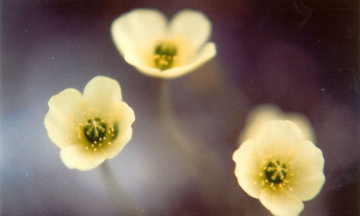

# Purple Saxifrage

---
Saxifraga oppositifolia, the purple saxifrage or purple mountain saxifrage)

---

a plant species of the genus Papaver. The species grows at a latitude of 83°40'N on Kaffeklubben Island,[1] making it (and the purple saxifrage also found on the island) the northern-most growing plant in the world. It is most commonly found in the Nunavaut region of Canada.
The Arctic poppy is restricted to small, mountainous areas in the northernmost regions of Norway and Sweden, where it is endemic. It is known from six to seven locations in Norway and two in Sweden.

This poppy appears on the Coat of arms of Nunavut.