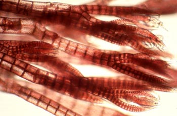

# Red Alagea

---
The red algae, or Rhodophyta

---

The red algae form a distinct group characterized by these attributes: eukaryotic cells without flagella and centrioles, using floridean polysaccharides as food reserves, with phycobiliproteins as accessory pigments (giving them their red color), and with chloroplasts lacking external endoplasmic reticulum and containing unstacked thylakoids. Most red algae are also multicellular, macroscopic, marine, and have sexual reproduction. They often have alternation of generations and may have three generations rather than two.
Many of the coralline algae, which secrete calcium carbonate and play a major role in building coral reefs, belong here. Red algae such as dulse (Palmaria palmata) and laver (nori/gim) are a traditional part of European and Asian cuisines and are used to make other products such as agar, carrageenans and other food additives. 

